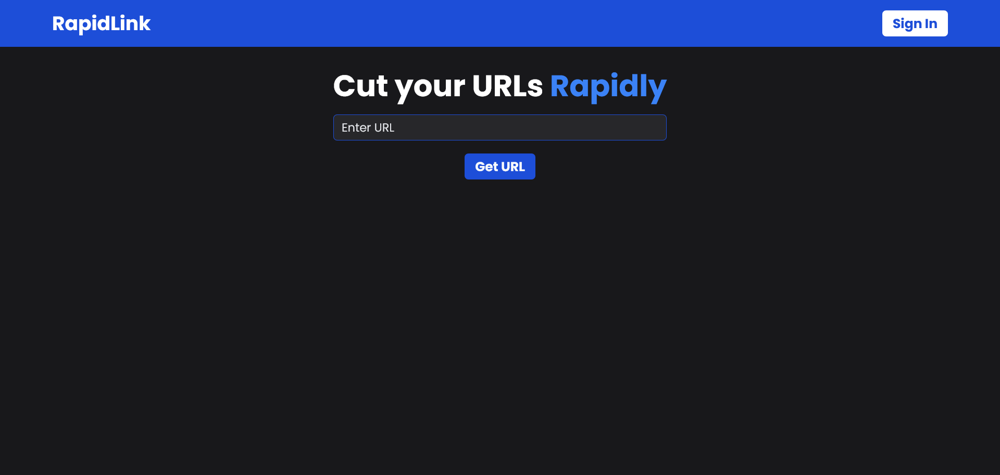

# RapidLink - ⭐URL Shortener

RapidLink helps you cut your URLs rapidly and easily

# Image

 

# About

I built this project with:

- [Next.js](https://www.npmjs.com/package/next)
- [Typescript](https://www.npmjs.com/package/typescript)
- [Tailwind CSS](https://www.npmjs.com/package/tailwindcss)
- [Clerk](https://www.npmjs.com/package/@clerk/nextjs)
- [React Hook Form](https://www.npmjs.com/package/react-hook-form)
- [Zod](https://www.npmjs.com/package/zod)
- [Prisma](https://www.npmjs.com/package/prisma)
- [shadcn/ui](https://shadcn.com/)
- [Short Unique ID](https://www.npmjs.com/package/short-unique-id)
- [React Icons](https://www.npmjs.com/package/react-icons)

# [Live Demo]()
