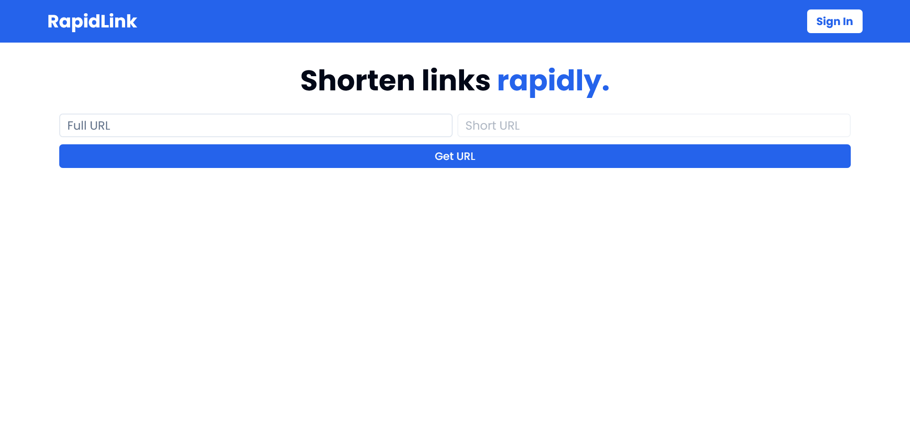

# 🚀 RapidLink


RapidLink, your go-to URL shortener, facilitates quick and easy link management with a user-friendly interface, making it the perfect solution for all your URL shortening needs. 🚀



## 🔗 Links

- [Live Demo](https://julian-rapidlink.vercel.app)

## 📐 Tech Stack

- Next.js
- Typescript
- Tailwind CSS
- Clerk Auth
- React Hook Form
- zod
- Prisma
- shadcn/ui
- Short Unique ID

## ✨ Usage

```bash
git clone https://github.com/piaseckijulian/RapidLink.git
cd RapidLink
pnpm dev
```

Next, duplicate the .env.example file, rename the duplicate to .env, and then input your environmental variables there.

```bash
pnpx prisma db push
```

That's it! - You're good to go. You can add new features, fix bugs etc.

## 🌐 Contribution

If you want to contribute to this amazing project simply raise an **Issue** when you found a bug or you are requesting a new feature. However if you want to do it yourself create a **Pull Request**.
