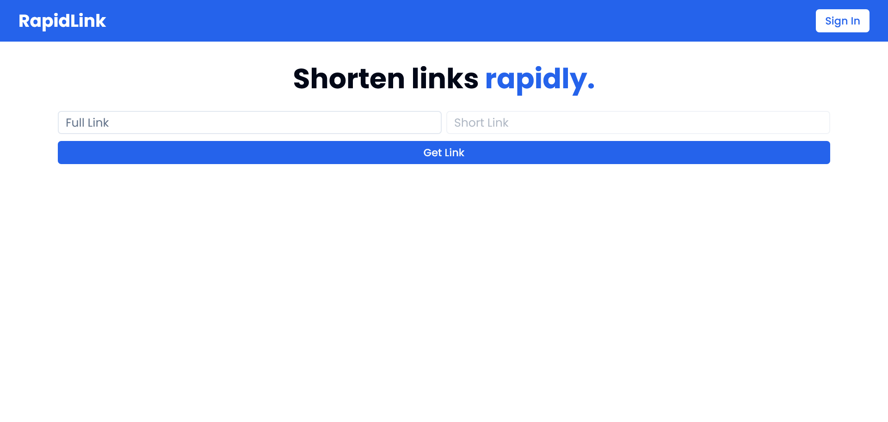

# 🚀 RapidLink


RapidLink, your go-to Link shortener, facilitates quick and easy link management with a user-friendly interface, making it the perfect solution for all your links shortening needs. 🚀



## 🔗 Links

- [Live Demo](https://julian-rapidlink.vercel.app)

## 📐 Tech Stack

- Next.js
- TypeScript
- Tailwind CSS
- shadcn/ui
- TanStack React Table
- Clerk
- React Hook Form
- Zod
- NanoID
- Clipboard Copy

## ✨ Usage

```bash
git clone https://github.com/piaseckijulian/RapidLink.git
cd RapidLink
pnpm dev
```

Next, duplicate the `.env.example` file, rename the duplicate to `.env`, and then input your environmental variables there.

```bash
pnpm db:push
```

That's it! - You're good to go. You can add new features, fix bugs etc.

## 🌐 License

This software is licensed under the [MIT License](https://github.com/piaseckijulian/RapidLink/blob/main/LICENSE)
